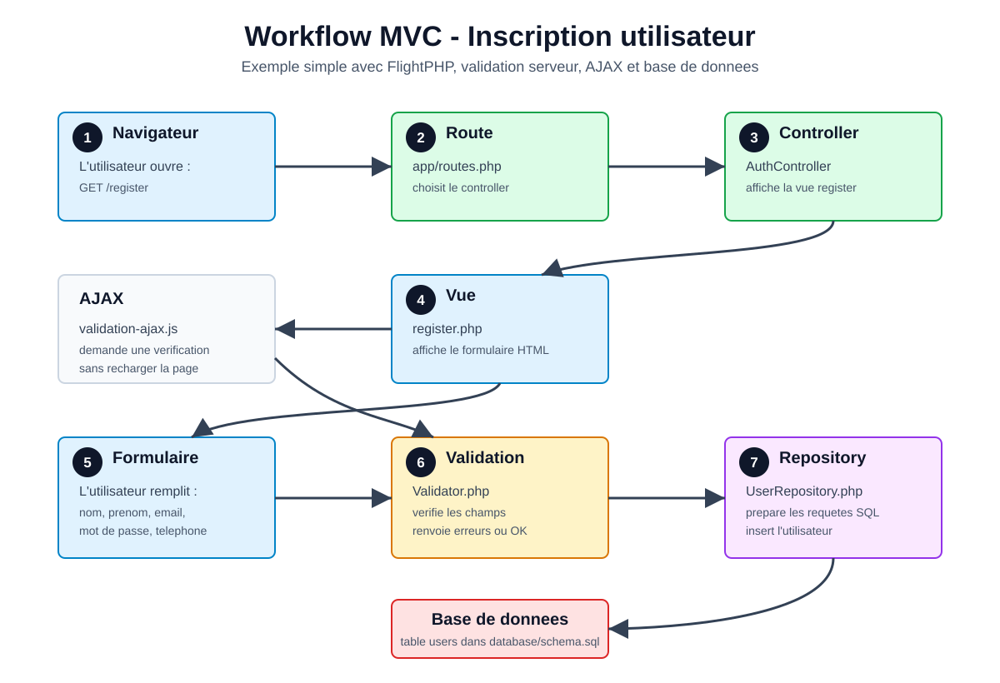

# Workflow MVC - Inscription

Cette fiche explique le chemin d'une inscription dans le projet.

## Idee simple

MVC veut dire :

- Model : la partie qui gere les donnees.
- View : la page HTML que l'utilisateur voit.
- Controller : la partie qui recoit la demande et choisit quoi faire.

Dans notre projet :

- View : `app/views/auth/register.php`
- Controller : `app/controllers/AuthController.php`
- Service : `app/services/UserService.php`
- Validation : `app/services/Validator.php`
- Repository : `app/repositories/UserRepository.php`
- Database : `database/schema.sql`

## Schema



## Exemple concret

L'utilisateur remplit le formulaire :

```text
Nom : Rakoto
Prenom : Miora
Email : miora@gmail.com
Mot de passe : 1234
Telephone : 0340000000
```

Le navigateur envoie les informations au serveur.

Le fichier `app/routes.php` dit :

```text
POST /register va vers AuthController::postRegister
```

Le controller appelle le service :

```text
AuthController demande a UserService d'inscrire l'utilisateur.
```

Le service appelle le validator :

```text
Validator verifie si les champs sont corrects.
```

Si le formulaire contient une erreur, par exemple email vide :

```text
Email invalide.
```

La page est reaffichee avec le message d'erreur.

Si tout est correct :

```text
UserRepository ajoute l'utilisateur dans la table users.
```

## Version tres courte a expliquer oralement

1. Le navigateur demande la page d'inscription.
2. La route envoie la demande au controller.
3. Le controller affiche la vue.
4. L'utilisateur remplit le formulaire.
5. Le service organise le travail.
6. Le validator verifie les champs.
7. Le repository enregistre dans la base de donnees.

## Pourquoi AJAX existe ici

AJAX sert a verifier les champs sans recharger toute la page.

Exemple :

```text
Je quitte le champ email.
JavaScript demande au serveur si le formulaire est correct.
Le serveur repond avec les erreurs.
La page affiche les erreurs directement.
```

Mais la vraie securite reste toujours cote serveur : quand on clique sur "S'inscrire", PHP verifie encore une fois.
